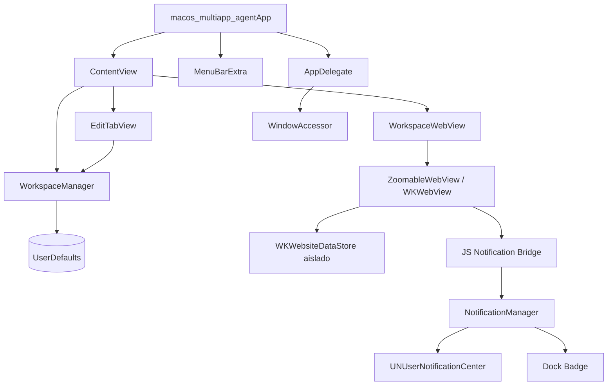

# 🖥️ macOS MultiApp Workspace

**Un espacio de trabajo unificado para macOS que consolida múltiples aplicaciones web en una sola ventana nativa.**

Inspirado en [Franz](https://meetfranz.com/) y [Rambox](https://rambox.app/), pero construido 100% en Swift/SwiftUI para un rendimiento óptimo y consumo mínimo de recursos.


---

## 📋 Tabla de Contenidos

- [Descripción](#-descripción)
- [Funcionalidades](#-funcionalidades)
- [Arquitectura y Diseño](#-arquitectura-y-diseño)
- [Servicios Soportados](#-servicios-soportados)
- [Requisitos](#-requisitos)
- [Instalación Local](#-instalación-local)
- [Uso](#-uso)
- [Configuración de Xcode](#-configuración-de-xcode)
- [Estructura del Proyecto](#-estructura-del-proyecto)
- [Contribuciones](#-contribuciones)
- [Roadmap](#-roadmap)
- [Licencia](#-licencia)

---

## 🎯 Descripción

**macOS MultiApp Workspace** es una aplicación nativa para macOS que permite ejecutar múltiples servicios web (WhatsApp, Slack, Microsoft Teams, Google Tasks, etc.) dentro de una única ventana con pestañas personalizables. Cada servicio se ejecuta en un `WKWebView` con **sesiones completamente aisladas**, permitiendo utilizar múltiples cuentas del mismo servicio sin conflictos.

### ¿Por qué este proyecto?

- 🚀 **Nativo de macOS** — Sin Electron, sin overhead. Rendimiento nativo real.
- 🔒 **Aislamiento de sesiones** — Cada instancia tiene su propio `WKWebsiteDataStore` con cookies, caché y localStorage independientes.
- 🪶 **Bajo consumo de recursos** — Usa WebKit nativo en lugar de instancias embebidas de Chromium.
- 🔔 **Notificaciones nativas** — Intercepta la Web Notifications API y las convierte en notificaciones nativas de macOS.
- 🎛️ **Personalizable** — Crea, elimina y configura pestañas con diferentes layouts y combinaciones de servicios.

---

## ✨ Funcionalidades

### 🗂️ Sistema de Pestañas Dinámicas

- **Crear pestañas personalizadas** con un nombre y layout a elección.
- **Editar pestañas existentes** — Renombra tus pestañas, cambia su disposición F×C o reconfigura los servicios sin perder los inicios de sesión anteriores.
- **Eliminar pestañas** con confirmación para evitar borrados accidentales.
- **Drag & Drop** — Arrastra las pestañas para reordenarlas con reordenamiento visual en tiempo real.
- **Persistencia automática** — La configuración de pestañas se guarda en `UserDefaults` y se restaura al reiniciar la app.
- Pestañas por defecto preconfiguradas (Comunicación y Tareas) en la primera ejecución.

### 📐 Layouts Flexibles (Notación F×C)

Sistema de layouts basado en notación **Filas × Columnas**, incluyendo sub-grillas:

| Layout             | Notación     | Servicios | Descripción                                              |
| ------------------ | ------------ | --------- | -------------------------------------------------------- |
| Pantalla Completa  | `1×1`        | 1         | Un solo servicio ocupa toda la pestaña                   |
| 2 Columnas         | `1×2`        | 2         | Dos servicios lado a lado (`HSplitView`)                 |
| 2 Filas            | `2×1`        | 2         | Dos servicios apilados (`VSplitView`)                    |
| Grilla 2×2         | `2×2`        | 4         | Grilla de 4 servicios en 2 filas y 2 columnas            |
| 3 Columnas         | `1×3`        | 3         | Tres servicios en columnas                               |
| 3 Filas            | `3×1`        | 3         | Tres servicios apilados                                  |
| Izq. Dividido      | `1(2×1)×1`   | 3         | Columna izq dividida en 2 + columna der entera           |
| Der. Dividido      | `1×1(2×1)`   | 3         | Columna izq entera + columna der dividida en 2           |

El formulario de creación incluye **mini previews visuales** con colores diferenciados para cada panel, facilitando la comprensión del layout antes de crearlo.

### 🔒 Aislamiento de Sesiones

- Cada instancia de servicio opera con un **`WKWebsiteDataStore` independiente**, identificado por un UUID determinista generado vía `SHA256`.
- Esto permite abrir, por ejemplo, **dos cuentas de Google Tasks** (personal y laboral) simultáneamente sin interferencias.
- Las sesiones (cookies, tokens, localStorage) persisten entre reinicios de la app.

### 🔔 Notificaciones Nativas de macOS

- **JS Bridge** que intercepta `window.Notification` en las web apps y los redirige a `UNUserNotificationCenter`.
- Las notificaciones se muestran con **banner, sonido y badge** incluso cuando la app está en primer plano.
- Al hacer clic en una notificación, la app se trae al frente automáticamente.
- Soporte para `Notification.requestPermission()` simulado (siempre `'granted'`).

### 🔴 Badge Counter en el Dock

- **Detección automática de badges** — Observa cambios en el `<title>` de las páginas web (via KVO) y extrae contadores con formatos como:
  - `(3) Slack`
  - `WhatsApp • 5`
- El **badge del ícono en el Dock** muestra la suma total de notificaciones pendientes de todas las sesiones activas.

### 🔍 Zoom de Página

- `Cmd + +` → Acercar zoom
- `Cmd + -` → Alejar zoom
- `Cmd + 0` → Restablecer zoom al 100%
- Zoom independiente por cada WebView, limitado entre 20% y 300%.

### 🏃 Ejecución en Segundo Plano

- Al cerrar la ventana (botón rojo), la app **no se destruye** — se oculta y sigue corriendo en segundo plano.
- Un **ícono en la barra de menú** (MenuBarExtra) permite:
  - Mostrar la ventana principal.
  - Cerrar completamente la aplicación.
- Al hacer clic en el ícono del Dock con la ventana oculta, se restaura sin crear una nueva ventana.

### 🌐 Compatibilidad con Servicios Modernos

- **User-Agent personalizado** de Safari 26 para compatibilidad con Slack, Microsoft Teams y otros servicios que validan el navegador.
- JavaScript habilitado para abrir ventanas automáticamente, necesario para flujos de autenticación OAuth de los servicios.
- Todas las redirecciones de navegación están permitidas.

---

## 🏛️ Arquitectura y Diseño

La aplicación sigue una arquitectura **MVVM** (Model-View-ViewModel) con SwiftUI y está organizada en los siguientes componentes:

```
┌─────────────────────────────────────────────────────────┐
│                  macos_multiapp_agentApp                 │
│  (Entry point, MenuBarExtra, AppDelegate)               │
├─────────────────┬───────────────────────────────────────┤
│   ContentView   │           EditTabView                 │
│  (TabView +     │  (Formulario para crear pestañas)     │
│   Toolbar)      │                                       │
├─────────────────┴───────────────────────────────────────┤
│                  WorkspaceWebView                       │
│  (NSViewRepresentable → WKWebView + JS Bridge)         │
│  ┌────────────┐ ┌──────────────┐ ┌────────────────┐    │
│  │ZoomableWeb │ │  Coordinator │ │  Notification  │    │
│  │   View     │ │ (Delegates)  │ │    Bridge JS   │    │
│  └────────────┘ └──────────────┘ └────────────────┘    │
├─────────────────────────────────────────────────────────┤
│                  WorkspaceManager                       │
│  (ObservableObject — persistencia en UserDefaults)      │
├───────────────┬─────────────────────────────────────────┤
│    Models     │          NotificationManager            │
│(Service, Tab, │  (UNUserNotificationCenter + Badge)     │
│  Layout)      │                                         │
├───────────────┴─────────────────────────────────────────┤
│                  AppLifecycle                            │
│  (AppDelegate + WindowAccessor para segundo plano)      │
└─────────────────────────────────────────────────────────┘
```

### Flujo de datos



---

## 🌐 Servicios Soportados

| Servicio        | URL                   | Identificador de Sesión |
| --------------- | --------------------- | ----------------------- |
| WhatsApp Web    | `web.whatsapp.com`    | `whatsapp`              |
| Slack           | `app.slack.com`       | `slack`                 |
| Microsoft Teams | `teams.microsoft.com` | `teams`                 |
| Google Tasks    | `tasks.google.com`    | `tasks`                 |
| Google Calendar | `calendar.google.com` | `gcalendar`             |
| Outlook Mail    | `outlook.live.com`    | `outlook`               |

> **Nota:** Los servicios se pueden usar múltiples veces en diferentes pestañas. Cada instancia genera un `sessionID` único para mantener sesiones independientes.

---

## 📦 Requisitos

| Requisito | Versión         |
| --------- | --------------- |
| **macOS** | 26.2 o superior |
| **Xcode** | 16.0 o superior |
| **Swift** | 5.0             |

### Frameworks utilizados (todos nativos del sistema)

- `SwiftUI` — Interfaz de usuario declarativa.
- `WebKit` — `WKWebView` para renderizar contenido web.
- `CryptoKit` — Generación de UUIDs deterministas vía SHA256.
- `UserNotifications` — Notificaciones nativas de macOS.
- `AppKit` — Gestión de ventanas, Dock badge y ciclo de vida.
- `Combine` — Binding reactivo de datos.

> **No se requieren dependencias externas.** El proyecto usa exclusivamente frameworks del sistema.

---

## 🛠️ Instalación Local

### 1. Clonar el repositorio

```bash
git clone https://github.com/jmibarra/macos-multiapp-agent.git
cd macos-multiapp-agent
```

### 2. Abrir en Xcode

```bash
open macos-multiapp-agent.xcodeproj
```

### 3. Configurar permisos de red (App Sandbox)

Para que los WebViews puedan cargar contenido web, es necesario habilitar las conexiones de red:

1. Selecciona el target **macos-multiapp-agent** en Xcode.
2. Ve a la pestaña **Signing & Capabilities**.
3. Si no existe, añade la capability **App Sandbox**.
4. Habilita:
   - ✅ **Outgoing Connections (Client)** — Necesario para conectar con los servicios web.
   - ✅ **Incoming Connections (Server)** — Opcional, puede ser necesario para OAuth callbacks.

### 4. Compilar y ejecutar

1. Selecciona **My Mac** como destino de ejecución.
2. Presiona `Cmd + R` o haz clic en el botón ▶️ **Run**.
3. La primera vez, macOS solicitará permisos de notificación — selecciona **Permitir**.

### 5. Verificar funcionamiento

- La app arrancará con dos pestañas predeterminadas: **Comunicación** (WhatsApp + Slack) y **Tareas** (dos instancias de Google Tasks).
- Usa el botón **+** en la toolbar para agregar nuevas pestañas.
- Usa el botón **🗑️** para eliminar la pestaña activa.
- Cierra la ventana (botón rojo) y verifica que la app sigue corriendo en la barra de menú.

---

## 🧑‍💻 Uso

### Crear una nueva pestaña

1. Haz clic en el botón **+** (Añadir Pestaña) en la toolbar.
2. Asigna un nombre a la pestaña.
3. Selecciona el layout entre las 8 opciones disponibles usando los **mini previews visuales**.
4. Elige los servicios web para cada posición del layout (los pickers se ajustan automáticamente).
5. Haz clic en **Crear Pestaña**.

### Eliminar una pestaña

1. Selecciona la pestaña que deseas eliminar.
2. Haz clic en el botón **🗑️** (Eliminar Pestaña) en la toolbar.
3. Confirma la eliminación.

### Gestionar la app en segundo plano

- **Cerrar ventana** → La app se oculta y sigue corriendo.
- **Barra de menú** → Usa el ícono de la barra de menú para mostrar la ventana o cerrar la app.
- **Dock** → Haz clic en el ícono del Dock para restaurar la ventana.

---

## ⚙️ Configuración de Xcode

### Capabilities necesarias

```
App Sandbox:
  ├── Outgoing Connections (Client): ✅
  └── Incoming Connections (Server): ✅ (opcional)
```

### Info.plist (adicional, si se necesita)

Si deseas que la app no tenga ícono visible en el Dock cuando está en segundo plano, puedes agregar:

```xml
<key>LSUIElement</key>
<true/>
```

> **Nota:** Esto hará que la app solo sea accesible desde la barra de menú.

---

## 📁 Estructura del Proyecto

```
macos-multiapp-agent/
├── macos-multiapp-agent.xcodeproj/   # Proyecto de Xcode
└── macos-multiapp-agent/
    ├── macos_multiapp_agentApp.swift  # Entry point — @main, WindowGroup, MenuBarExtra
    ├── Models.swift                   # Modelos: Service, LayoutType, ServiceInstance, WorkspaceTab
    ├── ContentView.swift              # Vista principal con TabView, toolbar y navegación
    ├── EditTabView.swift              # Formulario sheet para crear nuevas pestañas
    ├── WorkspaceWebView.swift         # WKWebView wrapper (NSViewRepresentable) con aislamiento
    ├── WorkspaceManager.swift         # ViewModel/Manager — CRUD de tabs + persistencia
    ├── NotificationManager.swift      # Gestor de notificaciones nativas + badge del Dock
    ├── AppLifecycle.swift             # AppDelegate + WindowAccessor (segundo plano)
    └── Assets.xcassets/               # Recursos gráficos de la app
```

### Descripción de archivos clave

| Archivo                     | Responsabilidad                                                                                                                                      |
| --------------------------- | ---------------------------------------------------------------------------------------------------------------------------------------------------- |
| `Models.swift`              | Define los servicios disponibles (`Service`), tipos de layout (`LayoutType`), instancias de servicio (`ServiceInstance`) y pestañas (`WorkspaceTab`) |
| `WorkspaceWebView.swift`    | Puente SwiftUI ↔ AppKit. Configura `WKWebView` con sesiones aisladas, inyecta el JS Bridge para notificaciones, maneja zoom y delegados              |
| `WorkspaceManager.swift`    | `ObservableObject` que administra el array de pestañas, persistencia en `UserDefaults` con codificación JSON                                         |
| `NotificationManager.swift` | Singleton que gestiona permisos, publica notificaciones nativas, mantiene badge counters por sesión y actualiza el badge del Dock                    |
| `AppLifecycle.swift`        | `AppDelegate` para manejar reopen del Dock y `WindowAccessor` que intercepta el cierre de ventana para ocultarla                                     |

---

## 🤝 Contribuciones

¡Las contribuciones son bienvenidas! Este proyecto es open source y valoramos la participación de la comunidad.

### Guía para contribuir

#### 1. Fork y Clone

```bash
# Hacer fork del repositorio en GitHub y luego:
git clone https://github.com/TU-USUARIO/macos-multiapp-agent.git
cd macos-multiapp-agent
```

#### 2. Crear una rama

```bash
# Usa un nombre descriptivo para tu rama
git checkout -b feature/nombre-de-tu-feature

# Ejemplos:
git checkout -b feature/soporte-discord
git checkout -b fix/zoom-no-funciona
git checkout -b docs/mejorar-readme
```

#### 3. Realizar los cambios

- Sigue el estilo de código existente (Swift con comentarios en español).
- Nombres de variables, funciones y clases **en inglés**.
- Comentarios y documentación del código **en español**.
- Asegúrate de que la app compile sin warnings.

#### 4. Commit y Push

```bash
git add .
git commit -m "feat: agregar soporte para Discord"
git push origin feature/soporte-discord
```

**Convención de commits:**
| Prefijo | Uso |
|---|---|
| `feat:` | Nueva funcionalidad |
| `fix:` | Corrección de bug |
| `docs:` | Cambios en documentación |
| `refactor:` | Refactorización sin cambio funcional |
| `style:` | Cambios de formato o estilo de código |
| `test:` | Agregar o modificar tests |

#### 5. Abrir un Pull Request

1. Ve a tu fork en GitHub.
2. Haz clic en **"Compare & Pull Request"**.
3. Describe tus cambios de forma clara.
4. Referencia issues relacionados (si aplica).

### Áreas donde puedes contribuir

- 🌐 **Agregar nuevos servicios** — Añadir más servicios al enum `Service` en `Models.swift`.
- 📐 **Nuevos layouts** — Implementar layouts aún más complejos o sub-grillas adicionales.
- 🎨 **Mejoras de UI/UX** — Íconos personalizados por servicio, temas, etc.
- 🔔 **Mejorar notificaciones** — Soporte para push notifications de ServiceWorkers.
- ⌨️ **Atajos de teclado** — Cambiar entre pestañas con `Cmd + 1/2/3...`.
- 🧪 **Testing** — Agregar unit tests y UI tests.
- 📖 **Documentación** — Mejorar docs, agregar capturas de pantalla, etc.
- 🐛 **Reportar bugs** — Abrir issues con pasos de reproducción.

### Código de conducta

Este proyecto sigue un código de conducta basado en el respeto mutuo. Se espera que todos los participantes:

- Sean respetuosos y constructivos en sus interacciones.
- Acepten feedback de forma profesional.
- Se enfoquen en lo mejor para la comunidad y el proyecto.

---

## 🗺️ Roadmap

- [ ] Soportar más servicios (Discord, Telegram, Gmail, Notion, etc.)
- [x] Layouts de grilla (2x2, 3x1, etc.)
- [ ] Atajos de teclado para cambiar entre pestañas
- [x] Edición de pestañas existentes (renombrar, cambiar servicios)
- [ ] Íconos personalizados por servicio en las pestañas
- [ ] Temas claros/oscuros personalizables
- [ ] Exportar/importar configuración de workspace
- [ ] Soporte para URLs personalizadas (servicios self-hosted)
- [ ] Barra lateral colapsable como alternativa a pestañas
- [x] Drag & drop para reordenar pestañas

---

## 📄 Licencia

Este proyecto está bajo la licencia **MIT**. Consulta el archivo [LICENSE](LICENSE) para más detalles.

---

## 🐞 Reporta un Problema

Si encuentras algún error o tienes una idea para mejorar el libro, abre un **Issue** en nuestro [tablero de Issues](https://github.com/jmibarra/macos-multiapp/issues). Por favor, incluye detalles claros y pasos para reproducir el problema si corresponde.

---

## 🤝 Contribución

¡Las contribuciones son bienvenidas! Si tienes ideas para nuevas funcionalidades, mejoras de rendimiento o correcciones de errores, me encantaría que colaboraras.

---

## 📬 Comunícate

Si tienes dudas o necesitas orientación, no dudes en contactarnos a través de los Issues o mail:  
✉️ [jmibarra86@gmail.com](mailto:jmibarra86@gmail.com)

También puedes encontrarme en LinkedIn:  
🔗 [Juan Manuel Ibarra - LinkedIn](https://www.linkedin.com/in/juan-manuel-ibarra-activity/)

## 🔑 Política de privacidad

Si tienes dudas puedes ver nuestra [política de privacidad](https://gist.github.com/jmibarra/cbaef743ac38b6c98e5c115f4f5310ad).

---

**¡Gracias por contribuir a mejorar esta herramienta!** 🌟  
Juntos podemos construir un recurso útil y abierto para la comunidad. 🙌

Si te gusta este proyecto y querés apoyar su desarrollo:

[](https://cafecito.app/jmibarradev)

---
